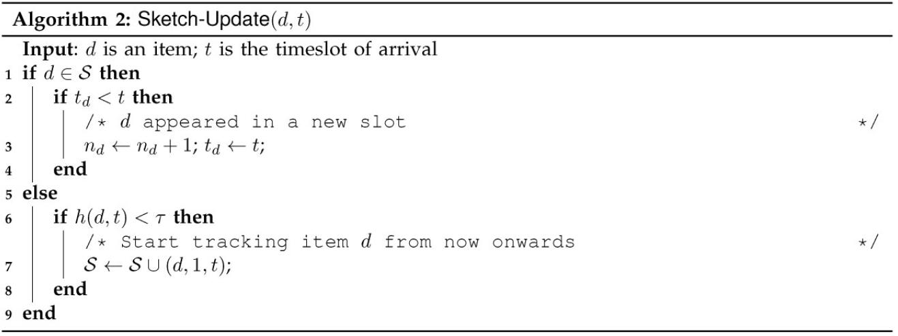
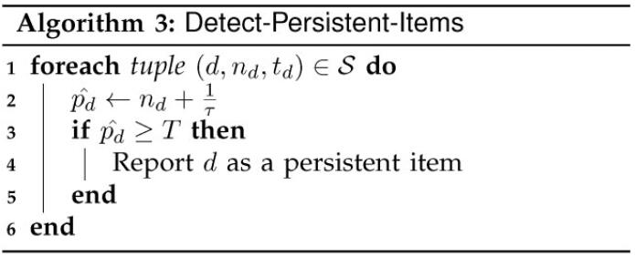
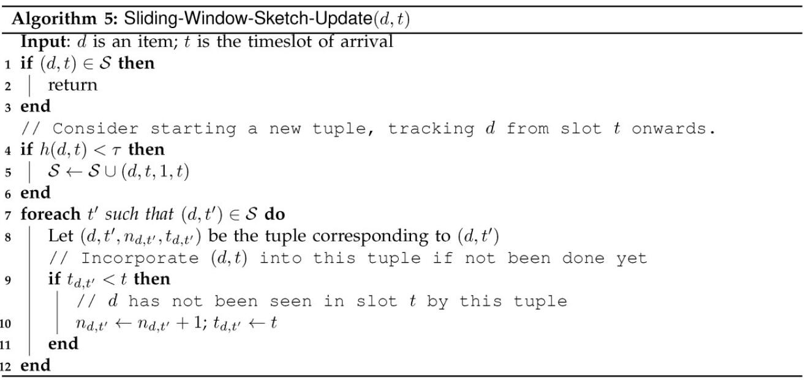

# Small-Space算法

## 简介

[Small-Space](https://lib.dr.iastate.edu/cgi/viewcontent.cgi?article=1177&context=ece_pubs)算法主要用来做finding persistent item。

只读了算法过程，没有读参数的数值选择和数学证明。

Small-Space算法建立一个"hash-based filter"，通过给定哈希函数$h(d,t)$和阈值$\tau$，对全体item做采样。可以工作在fixed window和sliding window上。

## Fixed Window

### 初始化与更新

$h(d,t)$的输出结果为$(0,1)$。值得说明的是，在同一个时间窗口$t$出现的相同item $d$，由于$h(d,t)$是相同的数，所以不会出现重复统计同一个时间窗口相同item的情况。

$d$代表一个item，$t$代表当前的时间窗口。$S$代表取样的item集合，$S$中一个项目的格式为$(d,n,t)$，$n$代表item $d$的persistence。这个数据结构可以看作是哈希表。

更新过程中，设当前时间窗口为$t$。

- 如果$d$已经在$S$中，表中的$d$记录的时间窗口$t_d<t$，就把$d$的persistence增加1​，把$t_d$更新为$t$。
- 如果$d$不在$S$中，根据给定的阈值$\tau$来决定是否对该item取样。如果要取样，就把$(d,1,t)$加入$S$中。

这里给定的阈值$\tau$是一个accuracy和space assumption的trade-off。设定$\tau$比较大，取样的就会更多，精确度更高，但是造成的空间开销也会更大。

这个算法使得经常出现的persistent items只要有一次被取样到了，后面的统计结果都是精确的。而不常出现的item被取样的概率会明显低于persistent item。

### 检测persistent items

这个算法没有仔细看，大致就是对统计的$n_d$加一点修正，与给定的persistent阈值$T$作比较。

## Sliding Window

在滑动窗口中，我们只关注当前的窗口$c$到过去的$c-n+1$这$n$个窗口中的persistent items。取样的item集合也相应变为$S_{c-n+1}^{c}$。

### 初始化与更新

这个算法是fixed window版本的扩展。

举个例子说明这个算法是如何进行更新的。

1. 假设$t_1$窗口接收了item $d_1$，且$h(d_1,t_1)<\tau$。根据第4行开始的伪代码，把$(d_1,t_1,1,t_1)$加入$S$中。

2. 然后在前面的时间窗口中遍历寻找，是否有一个仍在过去$n$个时间窗口以内的窗口$t'$，有$(d_1,t',n_{d_1,t'},t_{d_1,t'})\in S$。如果有的话，就把它的persistence增加1，并更新$t_{d_1,t'}$为$t_1$，代表最近出现的时间窗口。

    **这个例子中假设在$n$个时间窗口中之前未曾出现$d_1$。**此时$S$中与$d_1$有关的只有$(d_1,t_1,1,t_1)$。

3. $t_2$窗口又接收了item $d_1$，执行第1步的操作。假设$(d_1,t_2,1,t_2)$也加入了$S$中。
4. 找到了先前出现的$(d_1,t_1,1,t_1)$。然后更新为$(d_1,t_1,2,t_2)$。现在$S$中与$d_1$有关的有2个元组，$(d_1,t_1,2,t_2)$和$(d_1,t_2,1,t_2)$。

可以看到在滑动窗口的算法过程中，只要一个窗口出现了$d_1$，就要向$S$中新加入一个元组，还要更新之前的元组。

### 丢弃old items

更新算法使得丢弃超出$n$个时间窗口的old items非常简单。

#### 检测persistent items

$S_{cur}$代表找到当前$n$个时间窗口里，包含item $d$最早出现的时间窗口$t'$的元组集合。

### 算法的问题

这里只说fixed window。

1. 在数据流中，绝大多数的item都是non-persistent item。而Small-Space在整个数据流中取样，导致保存的大多数都是non-persistent item，浪费了大量空间。
2. 控制取样率的参数$\tau$不能设置得太高，会加大空间消耗。但是设置得低会有更高的错误率。
3. 使用哈希表作为数据结构，遇到哈希碰撞时会减小吞吐量。此外哈希表这个数据结构就需要比较大的空间。

